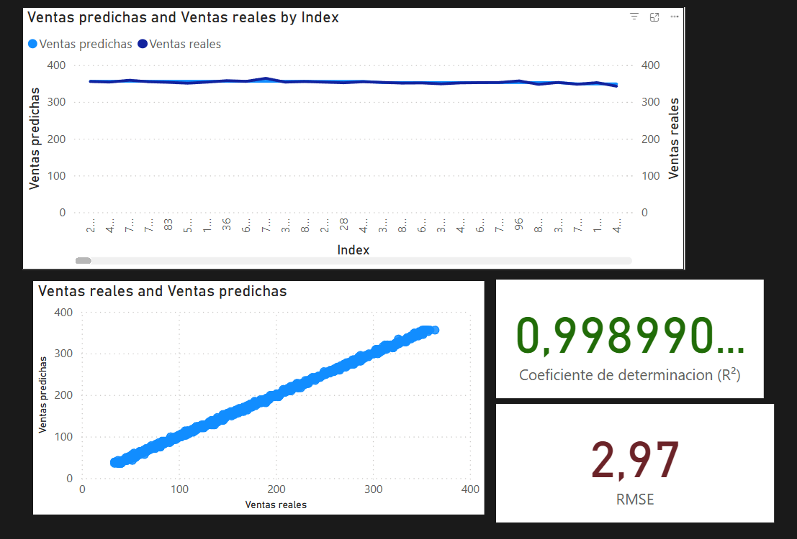

Informe: Predicción de Ventas con Python y Power BI

Introducción 🎓📊💡

Este proyecto surge como una extensión práctica de los conocimientos adquiridos previamente en un curso de ciencia de datos, donde inicialmente trabajé con herramientas visuales como RapidMiner para entrenar modelos predictivos. Con el objetivo de profundizar mis habilidades y profesionalizar mi enfoque, decidí trasladar ese flujo de trabajo al ecosistema Python, utilizando librerías especializadas y complementando el análisis con visualizaciones en Power BI. 📘🧠🧩

Objetivo 🎯📈🧮

Desarrollar un modelo predictivo que estime las ventas de una empresa en función del presupuesto asignado a diferentes canales de marketing: TV, radio, redes sociales e influencers. El resultado final se comunica en un informe visual mediante Power BI. 📊🗣️🔍

Dataset 📁📊🧾

Nombre del archivo: Dummy Data HSS

Columnas relevantes:

TV

Radio

Social Media

Influencer 

Sales (ventas)

Proceso 🔄🧪⚙️

Carga y limpieza de datos:    

Eliminación de filas con valores faltantes

Corrección de nombres de columnas con espacios

Transformación de la columna Influencer de texto a valores ordinales (Nano=1, Micro=2, Macro=3, Mega=4)

Análisis exploratorio:

Uso de seaborn y matplotlib para visualizar correlaciones y relaciones entre variables

Gráfico de calor (heatmap) para identificar relaciones fuertes entre variables independientes y Ventas

Modelado predictivo:

Algoritmo: Regresión Lineal Múltiple (scikit-learn)

División 80/20 para entrenamiento y prueba (train_test_split)

Evaluación con R² y MSE

Exportación de resultados:

Las predicciones se exportaron en un archivo CSV para ser utilizadas en Power BI

Resultados 📉📌📊

R²(Coeficiente de determinacion): 0.9989. 
Esto indica un ajuste casi perfecto. 
El 99.89% de la variabilidad en las ventas puede explicarse por el modelo. Es un resultado excelente, lo que sugiere que el modelo logra capturar casi toda la información relevante de los datos para predecir correctamente.
El modelo explica el 99.89% de las variaciones en las ventas.

MSE: 8.81. 
Esto representa el promedio del cuadrado de las diferencias entre las predicciones y los valores reales. Un valor bajo como este indica que el modelo comete pocos errores, aunque está en unidades al cuadrado y por eso no es directamente interpretable.

RMSE (Raíz del MSE): ≈ 2.97
Este valor se interpreta como la desviación estándar del error de predicción. Indica que, en promedio, las predicciones se desvían aproximadamente ±2.97 unidades de venta respecto al valor real. 

Los resultados muestran un ajuste casi perfecto, con un error cuadrático medio muy bajo. Esto puede estar influenciado por la calidad del dataset. 📏🔬✅

Visualización en Power BI 📊🖥️🧭

El archivo generado fue importado a Power BI para construir un dashboard interactivo que muestra:

1. Gráfico de líneas

    Compara Ventas reales vs. Ventas predichas a lo largo del índice de observación

    Muestra que ambas curvas se superponen, indicando un muy buen ajuste del modelo

2. Gráfico de dispersión

    Eje X: Ventas reales

    Eje Y: Ventas predichas

    Los puntos forman una diagonal casi perfecta, lo cual visualmente valida la precisión del modelo

3. KPIs

    R² = 0.99899 → el modelo explica casi toda la variabilidad en las ventas.

    RMSE = 2.97 → el modelo se equivoca en promedio menos de 3 unidades de ventas.
   

Conclusión 🧠📚🚀

Este proyecto representó la transición de un enfoque visual aprendido en la asignatura "Ciencia de Datos" de la Univesidad Tecnologica Nacional a una implementación con programacion. Utilizar Python me permitió controlar cada paso del proceso, desde la limpieza de datos hasta el modelado y la evaluación, mientras que Power BI aportó una capa profesional para comunicar insights al negocio. 🔁🧰🔍

